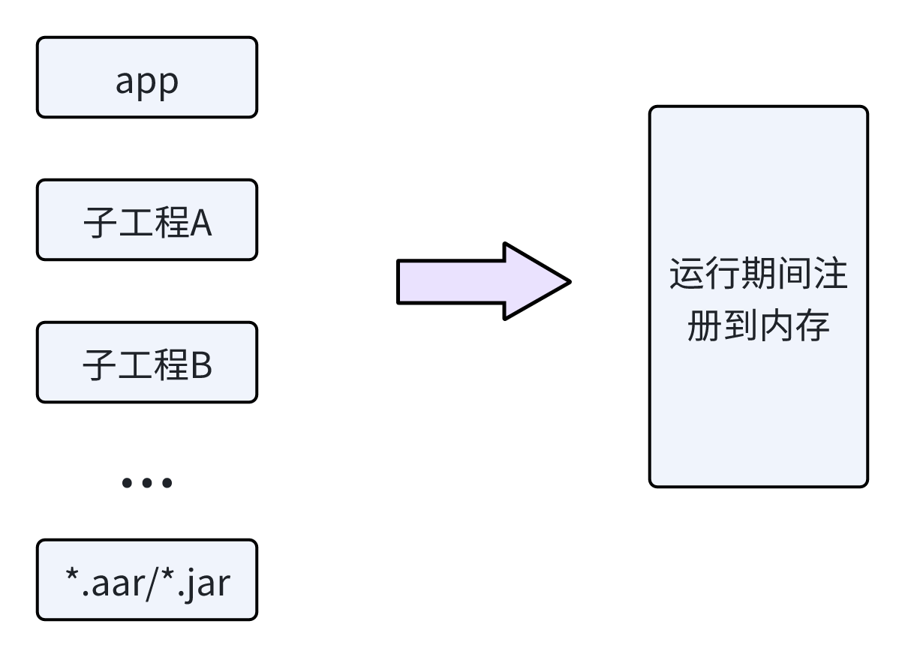
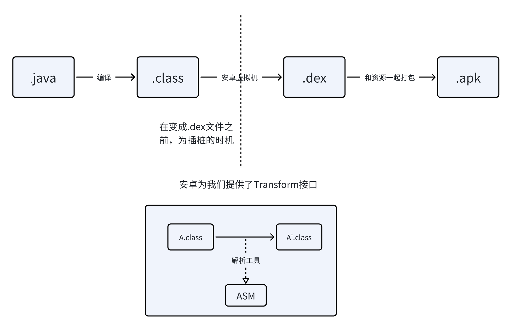

# 自定义路由框架详解（四）- 注册映射

飞书链接：[自定义路由框架详解（四）- 注册映射](https://is0frj68ok.feishu.cn/wiki/Ahutwn0YziO8BdkIqnmcbdnFnZr?from=from_copylink)

上一步的生成文档中，我们只是把散落在每个子工程中的注册汇聚到了一起，形成了一个文档，供开发者查看。

但当下游调用者需要通过router路径跳转时，我们必须保证内存中有一份汇聚了每个子工程注册的总表，查找到对应的类之后跳转，而这，正是我们这一步需要完成的。



这一步，我们需要用到的技术是字节码插桩，让我们先简单介绍一下字节码插桩

### 字节码插桩是什么？

#### 字节码

Java中的字节码是Java源代码被Java编译器编译后的中间代码形式。它不是专门为任何特定的处理器设计的机器代码，而是一种“虚拟机代码”，旨在由Java虚拟机（JVM）在运行时解释或编译成本地机器代码执行。字节码使得Java程序具有跨平台性，即“一次编写，到处运行”（Write Once, Run Anywhere）的能力。每一条字节码指令通常由一个字节长度的操作码所组成，可能还会跟随着一些用于指示操作数或跳转地址等的参数。

例如，当你用Java编写一个简单的“Hello, World!”程序并编译它时，编译器（如javac）会将这个程序转换成一系列字节码指令，这些指令随后可以在任何安装了相应版本JVM的设备上运行。这种机制确保了Java程序的高度可移植性和平台独立性。

安卓中，java或者kotlin源码会被javac或者kotlinc编译成.class文件，也就是字节码。字节码随后会被安卓虚拟机编译成dex文件，最终被打包到apk里面，然后运行到用户手机上。

#### 字节码插桩

字节码插桩是一种在运行时（或加载时）动态修改Java字节码的技术，这种技术不需要修改源代码。通过这种方式，开发人员或工具可以在类文件加载到Java虚拟机（JVM）之前或运行时，向字节码中添加额外的操作，以实现特定的功能，如性能监控、日志记录、安全检查或其他任何形式的增强。

在.class文件转化成.dex文件之前，修改.class文件，从而达到修改或者替换代码的目的

### 字节码插桩的技术原理

下图是安卓打包的过程，插桩的时间在由.class文件到.dex文件之间



我们需要在自定义的gradle插件里，注册一个Transform接口，就可以在对应的回调里收到所有编译好的.class字节码，然后我们再使用ASM工具对字节码进行解析和修改

### 第一步：实现RouterMappingTransform

1. 定义Transform：`RouterMappingTransform`类需要继承自`Transform`类，并重写相关方法，例如`getName`、`getInputTypes`、`getScopes`以及`isIncremental`。这些方法定义了Transform的基本属性和行为。
2. 处理输入：在`transform`方法中，遍历所有的输入文件（包括目录输入和JAR输入），并对它们进行处理。这里的处理可能包括复制文件、修改字节码或生成新的字节码文件。
3. 生成映射类：使用`RouterMappingByteCodeBuilder`来生成映射类的字节码。这个类将包含所有路由的映射信息，以便在运行时进行查询。

在`RouterMappingTransform`类中，关键的代码如下。`RouterMappingTransform`需要重写以下几个方法

```Groovy
import com.android.build.api.transform.Format
import com.android.build.api.transform.QualifiedContent
import com.android.build.api.transform.Transform
import com.android.build.api.transform.TransformException
import com.android.build.api.transform.TransformInvocation
import com.android.build.gradle.internal.pipeline.TransformManager

import java.util.jar.JarOutputStream
import java.util.zip.ZipEntry

class RouterMappingTransform extends Transform {

    /**
     * 当前 Transform 的名称
     * @return
     */
    @Override
    String getName() {
        return "RouterMappingTransform"
    }

    /**
     * 返回告知编译器，当前Transform需要消费的输入类型
     * 在这里是CLASS类型
     * @return
     */
    @Override
    Set<QualifiedContent.ContentType> getInputTypes() {
        return TransformManager.CONTENT_CLASS
    }

    /**
     * 告知编译器，当前Transform需要收集的范围
     * @return
     */
    @Override
    Set<? super QualifiedContent.Scope> getScopes() {
        return TransformManager.SCOPE_FULL_PROJECT
    }

    /**
     * 是否支持增量
     * 通常返回False
     * @return
     */
    @Override
    boolean isIncremental() {
        return false
    }

    /**
     * 所有的class收集好以后，会被打包传入此方法
     * @param transformInvocation
     * @throws TransformException
     * @throws InterruptedException
     * @throws IOException
     */
    @Override
    void transform(TransformInvocation transformInvocation)
            throws TransformException, InterruptedException, IOException {
        // 1. 遍历所有的Input
        // 2. 对Input进行二次处理
        // 3. 将Input拷贝到目标目录
        
        // 代码省略
    }
}
```

简单解释一下上面的几个方法


getInputTypes，*告知编译器，当前Transform需要消费的输入类型*

\>>>> 插入

在Android构建系统中，`QualifiedContent.ContentType`定义了`Transform`可以处理的输入类型。`CONTENT_CLASS`是其中一种类型，专门指代编译后的Java类文件（`.class`文件）。除了`CONTENT_CLASS`，还有其他几种选项，允许`Transform`针对不同的内容进行操作：

1. `CONTENT_CLASS`: 如之前所述，这代表编译后的Java类文件。

2. `CONTENT_RESOURCES`: 指代与Java类不同的资源文件，比如图片、XML布局文件等。这使得`Transform`可以操作除了代码之外的资源，以实现资源的优化、检查或修改等操作。

3. `CONTENT_DEX`: 在某些情况下，`Transform`可能需要直接操作或分析DEX文件（Dalvik可执行文件），这是Android平台上应用的最终执行格式。`CONTENT_DEX`允许`Transform`在DEX级别上进行操作，如DEX文件的合并、优化或修改。

4. `CONTENT_JARS`: 这通常指代包含编译后Java类的JAR文件。对于那些需要在JAR级别而不是单独类文件级别上进行操作的`Transform`来说，这是一个有用的选项。例如，可能需要修改或替换JAR文件中的某些类或资源。

5. `CONTENT_NATIVE_LIBS`: 指代应用中使用的本地库文件（如.so文件）。这允许`Transform`对这些本地库进行操作，比如重命名、移动或修改它们。

6. `CONTENT_ASSETS`: 指代应用的assets文件夹中的内容，可以包括任何类型的文件，如文本、音频或视频文件。`Transform`可以对这些文件执行操作，如添加、删除或修改。

   

getScopes *告知编译器，当前Transform需要收集的范围*

\>>>>插入

在Android构建系统中，`Transform` API通过`getScopes`方法允许定义`Transform`关注的范围。`SCOPE_FULL_PROJECT`是其中一种范围，表示`Transform`将作用于整个项目的所有内容。除了`SCOPE_FULL_PROJECT`，还有其他几种范围选项，使得开发者可以根据需要精细地控制`Transform`的作用域：

1. `SCOPE_FULL_PROJECT`: 此范围包括整个项目，包括所有的模块、库依赖等。
2. `SCOPE_PROJECT`: 仅包括项目中的主模块，不包括其依赖的库。
3. `SCOPE_SUB_PROJECTS`: 包括项目中所有的子模块，但不包括主模块。
4. `SCOPE_EXTERNAL_LIBRARIES`: 仅包括外部库依赖，即项目所依赖的所有第三方库。
5. `SCOPE_PROVIDED_ONLY`: 包括仅在编译时提供的依赖，而不包括运行时需要的依赖。这主要用于那些在编译时必须要用到，但是在运行时由容器或其他方式提供的依赖。
6. `SCOPE_TESTED_CODE`: 包括测试代码和被测试代码的范围。这对于执行测试相关的Transform操作特别有用。

每个`Transform`可以根据其需要来选择一个或多个范围，以确保它仅作用于相关的部分。例如，如果一个`Transform`只需要处理项目的主模块，那么可以选择`SCOPE_PROJECT`。如果需要处理所有包括第三方库在内的依赖，则可以选择`SCOPE_FULL_PROJECT`或同时选择`SCOPE_PROJECT`、`SCOPE_SUB_PROJECTS`和`SCOPE_EXTERNAL_LIBRARIES`等。

通过精确地控制作用范围，`Transform`能够更有效地执行，同时避免不必要的处理，从而优化构建过程的性能。


isIncremental 是否支持增量编译

\>>>> 插入

`isIncremental`方法在Android构建系统中的`Transform` API中定义了该`Transform`是否支持增量编译。增量编译是一种优化技术，旨在通过只重新编译自上次构建以来已更改或新增的部分，而不是每次都重新编译整个项目，来加速构建过程。

当`isIncremental`方法返回`true`时，表示该`Transform`支持增量编译。这意味着构建系统在执行构建时会传递给`Transform`仅包含更改部分的输入，而不是项目的全部内容。这样，`Transform`可以只对那些自上次构建以来发生变化的文件进行处理，从而减少不必要的工作量和提高构建速度。

如果`isIncremental`方法返回`false`，则表示该`Transform`不支持增量编译。在这种情况下，无论是全新构建还是增量构建，构建系统都会将项目的所有相关输入传递给`Transform`进行处理。这可能会导致每次构建时都有较高的开销，因为即使只有少量文件发生变化，也需要处理整个项目的输入。

支持增量编译的`Transform`需要能够区分和处理增量构建中的不同类型的变化，包括新增文件、修改文件和删除文件。这通常需要`Transform`实现更复杂的逻辑来确保正确处理所有这些情况，并保持构建的正确性。

因此，实现增量编译支持可以显著提高构建效率，特别是在大型项目中，但同时也增加了`Transform`开发的复杂性。开发者在设计`Transform`时需要权衡是否实现增量编译支持以及如何实现，以达到构建性能和开发维护成本之间的最佳平衡。


现在看到transform方法中的内容：

在`transform`方法中，遍历所有的输入文件（包括目录输入和JAR输入，也就是下面代码中的it.directoryInputs.each 和 it.jarInputs.each），并对它们进行处理。我们调用了RouterMappingCollector 中的collect方法，来收集所有相关的类名（也就是RouterMapping_xxx.java，这是在第二步中生成的）

使用`RouterMappingByteCodeBuilder`来生成映射类的字节码。这个类将包含所有路由的映射信息，以便在运行时进行查询。

```Groovy
@Override
void transform(TransformInvocation transformInvocation)
        throws TransformException, InterruptedException, IOException {
    // 1. 遍历所有的Input
    // 2. 对Input进行二次处理
    // 3. 将Input拷贝到目标目录

    RouterMappingCollector collector = new RouterMappingCollector()

    // 遍历所有的输入
    transformInvocation.inputs.each {

        // 把 文件夹 类型的输入，拷贝到目标目录
        it.directoryInputs.each { directoryInput ->
            def destDir = transformInvocation.outputProvider
                            .getContentLocation(
                                    directoryInput.name,
                                    directoryInput.contentTypes,
                                    directoryInput.scopes,
                                    Format.DIRECTORY)
            collector.collect(directoryInput.file)
            println("destDir: " + destDir)
            com.imooc.router.gradle.FileUtils.copyFolder(directoryInput.file.absolutePath, destDir.absolutePath)
        }

        // 把 JAR 类型的输入，拷贝到目标目录
        it.jarInputs.each { jarInput ->
            def dest = transformInvocation.outputProvider
                          .getContentLocation(
                                  jarInput.name,
                                  jarInput.contentTypes,
                                  jarInput.scopes, Format.JAR)
            collector.collectFromJarFile(jarInput.file)
            com.imooc.router.gradle.FileUtils.copyFile(jarInput.file, dest)
        }
    }

    println("${getName()} all mapping class name = "
            + collector.mappingClassName)

    File mappingJarFile = transformInvocation.outputProvider.
                            getContentLocation(
                                     "router_mapping",
                                      getOutputTypes(),
                                      getScopes(),
                                      Format.JAR)

    println("${getName()}  mappingJarFile = $mappingJarFile")

    if (mappingJarFile.getParentFile().exists()) {
        mappingJarFile.getParentFile().mkdirs()
    }

    if (mappingJarFile.exists()) {
        mappingJarFile.delete()
    }

    // 将生成的字节码，写入本地文件
    FileOutputStream fos = new FileOutputStream(mappingJarFile)
    JarOutputStream jarOutputStream = new JarOutputStream(fos)
    ZipEntry zipEntry =
            new ZipEntry(RouterMappingByteCodeBuilder.CLASS_NAME + ".class")
    jarOutputStream.putNextEntry(zipEntry)
    jarOutputStream.write(
            RouterMappingByteCodeBuilder.get(collector.mappingClassName))
    jarOutputStream.closeEntry()
    jarOutputStream.close()
    fos.close()
}
```

\>>>>插入

`transform`方法的参数`TransformInvocation`的介绍

`transform`方法是Android构建系统中`Transform` API的核心，它负责执行实际的转换逻辑。该方法的参数`TransformInvocation`提供了执行`Transform`所需的上下文和数据。`TransformInvocation`对象封装了当前`Transform`运行时的所有相关信息，包括输入、输出路径、是否为增量构建等信息，允许开发者根据这些信息执行具体的字节码操作或其他处理逻辑。

`TransformInvocation`主要提供以下几个关键功能：

1. 输入和输出: 通过`TransformInvocation`，你可以访问到当前`Transform`的输入和输出目录。输入可能包括类文件、资源文件等，具体取决于`getInputTypes`和`getScopes`方法的返回值。`TransformInvocation`允许你遍历这些输入，以便进行处理。同时，它也提供了输出目录的位置，你需要将处理后的文件输出到这个位置。
2. 增量构建支持: 如果`Transform`声明支持增量构建（即`isIncremental`方法返回`true`），`TransformInvocation`会提供一个增量的输入模型。这个模型让你知道自上次构建以来哪些文件被添加、修改或删除，从而只对那些变化的文件进行处理，而不是整个项目。
3. 上下文信息: `TransformInvocation`提供了当前构建的上下文信息，比如是否为增量构建。这允许`Transform`根据构建类型（全新构建还是增量构建）调整其行为。
4. 辅助对象: `TransformInvocation`还可以提供一些辅助对象，如`Context`，它允许你查询项目的一些基本信息，例如项目名称、版本等。

在`transform`方法内，开发者需要编写逻辑来遍历`TransformInvocation`提供的输入，执行所需的转换（如修改字节码、添加日志等），并将结果输出到指定的输出目录。这个过程可能包括读取和分析类文件、修改类文件内容、生成新的资源文件等操作，具体取决于`Transform`的目的。

通过`TransformInvocation`，`Transform`能够以高度定制化的方式介入构建过程，执行复杂的处理逻辑，从而为Android应用和库的构建提供强大的扩展和优化能力。

### 第二步：收集映射信息

1. 定义RouterMappingCollector：这个类负责从项目的编译输入中收集所有的路由映射信息。它会检查所有的类文件，寻找符合特定命名规则的类，并收集这些类的名称。
2. 处理类文件和JAR：`RouterMappingCollector`需要能够处理单个类文件和包含在JAR文件中的类文件。对于每个找到的映射类，将其名称添加到一个集合中，以便后续生成映射类时使用。

`RouterMappingCollector`类用于从编译输入中收集映射信息，关键代码如下：

```Groovy
package com.imooc.router.gradle

import java.util.jar.JarEntry
import java.util.jar.JarFile

class RouterMappingCollector {

    private static final String PACKAGE_NAME = 'com/imooc/router/mapping'
    private static final String PACKAGE_NAME2 = 'com\\imooc\\router\\mapping'
    private static final String CLASS_NAME_PREFIX = 'RouterMapping_'
    private static final String CLASS_FILE_SUFFIX = '.class'

    private final Set<String> mappingClassNames = new HashSet<>()

    /**
     * 获取收集好的映射表类名
     * @return
     */
    Set<String> getMappingClassName() {
        return mappingClassNames;
    }

    /**
     * 收集class文件或者class文件目录中的映射表类。
     * @param classFile
     */
    void collect(File classFile) {
        if (classFile == null || !classFile.exists()) return
        if (classFile.isFile()) {
            if ((classFile.absolutePath.contains(PACKAGE_NAME) || classFile.absolutePath.contains(PACKAGE_NAME2))
                 && classFile.name.startsWith(CLASS_NAME_PREFIX)
                 && classFile.name.endsWith(CLASS_FILE_SUFFIX)) {
                String className =
                        classFile.name.replace(CLASS_FILE_SUFFIX, "")
                mappingClassNames.add(className)
                println("collect Mapping files: " + classFile.getName())
            }
            println("collect Not Mapping files: " + classFile.getName() + " absolute path: " + classFile.absolutePath)
        } else {
            classFile.listFiles().each {
                collect(it)
            }
//            println("collect files: " + classFile.getName())
        }
    }

    /**
     * 收集JAR包中的目标类
     * @param jarFile
     */
    void collectFromJarFile(File jarFile) {

        Enumeration enumeration = new JarFile(jarFile).entries()

        while (enumeration.hasMoreElements()) {
            JarEntry jarEntry = (JarEntry)enumeration.nextElement()
            String entryName = jarEntry.getName()
            if (entryName.contains(PACKAGE_NAME)
               && entryName.contains(CLASS_NAME_PREFIX)
               && entryName.contains(CLASS_FILE_SUFFIX)) {
                String className = entryName
                        .replace(PACKAGE_NAME, "")
                        .replace("/", "")
                        .replace(CLASS_FILE_SUFFIX, "")

                mappingClassNames.add(className)
            }
        }
    }

}
```

### 第三步：创建RouterMappingByteCodeBuilder

在这一步，我们会生成一个类似如下的java文件

```Java
package com.imooc.router.demo.sample;

import java.util.HashMap;
import java.util.Map;

public class RouterMapping {

    public static Map<String, String> get() {

        Map<String, String> map = new HashMap<>();

        map.putAll(RouterMapping_1.get());

        map.putAll(RouterMapping_2.get());

        // ...

        return map;

    }

}
```

有了这个文件之后，我们只需要调用RouterMapping.get() 就可以拿到所有注册了的路由选项。

因为我们操作的是字节码，我们生成的是字节码，我们需要通过 ASM 来生成上面RouterMapping.java对应的字节码文件。

`RouterMappingByteCodeBuilder`利用ASM库来动态生成字节码，下面的 get 方法，通过 ASM 提供的ClassWriter 构建了字节码，让我们来具体看到这个过程。

```Groovy
package com.imooc.router.gradle

import org.objectweb.asm.ClassWriter
import org.objectweb.asm.MethodVisitor
import org.objectweb.asm.Opcodes

class RouterMappingByteCodeBuilder implements Opcodes {

    public static final String CLASS_NAME =
            "com/imooc/router/mapping/generated/RouterMapping"

    static byte[] get(Set<String> allMappingNames) {
        // 1. 创建一个类
        // 2. 创建构造方法
        // 3. 创建get方法
        //   （1）创建一个Map
        //   （2）塞入所有映射表的内容
        //   （3）返回map

        ClassWriter cw = new ClassWriter(ClassWriter.COMPUTE_MAXS)

        cw.visit(V1_7,
                ACC_PUBLIC + ACC_SUPER,
                CLASS_NAME,
                null,
                "java/lang/Object",
                null
         )

        // 生成或者编辑方法
        MethodVisitor mv

        // 创建构造方法
        mv = cw.visitMethod(Opcodes.ACC_PUBLIC,
                "<init>",
                "()V",
                null,
                null)

        mv.visitCode()
        mv.visitVarInsn(Opcodes.ALOAD, 0)
        mv.visitMethodInsn(Opcodes.INVOKESPECIAL,
                "java/lang/Object", "<init>", "()V", false)
        mv.visitInsn(Opcodes.RETURN)
        mv.visitMaxs(1, 1)
        mv.visitEnd()

        // 创建get方法
        mv = cw.visitMethod(ACC_PUBLIC + ACC_STATIC,
                "get",
                "()Ljava/util/Map;",
                "()Ljava/util/Map<Ljava/lang/String;Ljava/lang/String;>;",
                null)

        mv.visitCode()

        mv.visitTypeInsn(NEW, "java/util/HashMap")
        mv.visitInsn(DUP)
        mv.visitMethodInsn(INVOKESPECIAL,
              "java/util/HashMap", "<init>", "()V", false)
        mv.visitVarInsn(ASTORE, 0)

        // 向Map中，逐个塞入所有映射表的内容
        allMappingNames.each {

            mv.visitVarInsn(ALOAD, 0)
            mv.visitMethodInsn(INVOKESTATIC,
                      "com/imooc/router/mapping/$it",
                       "get", "()Ljava/util/Map;", false)
            mv.visitMethodInsn(INVOKEINTERFACE,
                "java/util/Map",
                    "putAll",
                    "(Ljava/util/Map;)V", true)
        }

        // 返回map
        mv.visitVarInsn(ALOAD, 0)
        mv.visitInsn(ARETURN)
        mv.visitMaxs(2, 2)

        mv.visitEnd()

        return cw.toByteArray()
    }

}
```

下面的代码是由android studio中的插件ASM Bytecode Viewer Support Kotlin生成的ASMified文件，为上面给出的RouterMapping 文件对应的由 ASM 生成的代码（ 下面的代码调用dump()方法最终可以生成RouterMapping 文件）。

```Java
package asm.com.imooc.router.demo.sample;

import org.objectweb.asm.AnnotationVisitor;
import org.objectweb.asm.Attribute;
import org.objectweb.asm.ClassReader;
import org.objectweb.asm.ClassWriter;
import org.objectweb.asm.ConstantDynamic;
import org.objectweb.asm.FieldVisitor;
import org.objectweb.asm.Handle;
import org.objectweb.asm.Label;
import org.objectweb.asm.MethodVisitor;
import org.objectweb.asm.Opcodes;
import org.objectweb.asm.Type;
import org.objectweb.asm.TypePath;

public class RouterMappingDump implements Opcodes {

    public static byte[] dump() throws Exception {

        ClassWriter classWriter = new ClassWriter(0);
        FieldVisitor fieldVisitor;
        MethodVisitor methodVisitor;
        AnnotationVisitor annotationVisitor0;

        classWriter.visit(V1_8, ACC_PUBLIC | ACC_SUPER, "com/imooc/router/demo/sample/RouterMapping", null, "java/lang/Object", null);

        classWriter.visitSource("RouterMapping.java", null);

        {
            methodVisitor = classWriter.visitMethod(ACC_PUBLIC, "<init>", "()V", null, null);
            methodVisitor.visitCode();
            Label label0 = new Label();
            methodVisitor.visitLabel(label0);
            methodVisitor.visitLineNumber(6, label0);
            methodVisitor.visitVarInsn(ALOAD, 0);
            methodVisitor.visitMethodInsn(INVOKESPECIAL, "java/lang/Object", "<init>", "()V", false);
            methodVisitor.visitInsn(RETURN);
            Label label1 = new Label();
            methodVisitor.visitLabel(label1);
            methodVisitor.visitLocalVariable("this", "Lcom/imooc/router/demo/sample/RouterMapping;", null, label0, label1, 0);
            methodVisitor.visitMaxs(1, 1);
            methodVisitor.visitEnd();
        }
        {
            methodVisitor = classWriter.visitMethod(ACC_PUBLIC | ACC_STATIC, "get", "()Ljava/util/Map;", "()Ljava/util/Map<Ljava/lang/String;Ljava/lang/String;>;", null);
            methodVisitor.visitCode();
            Label label0 = new Label();
            methodVisitor.visitLabel(label0);
            methodVisitor.visitLineNumber(10, label0);
            methodVisitor.visitTypeInsn(NEW, "java/util/HashMap");
            methodVisitor.visitInsn(DUP);
            methodVisitor.visitMethodInsn(INVOKESPECIAL, "java/util/HashMap", "<init>", "()V", false);
            methodVisitor.visitVarInsn(ASTORE, 0);
            Label label1 = new Label();
            methodVisitor.visitLabel(label1);
            methodVisitor.visitLineNumber(12, label1);
            methodVisitor.visitVarInsn(ALOAD, 0);
            methodVisitor.visitMethodInsn(INVOKESTATIC, "com/imooc/router/demo/sample/RouterMapping_1", "get", "()Ljava/util/Map;", false);
            methodVisitor.visitMethodInsn(INVOKEINTERFACE, "java/util/Map", "putAll", "(Ljava/util/Map;)V", true);
            Label label2 = new Label();
            methodVisitor.visitLabel(label2);
            methodVisitor.visitLineNumber(14, label2);
            methodVisitor.visitVarInsn(ALOAD, 0);
            methodVisitor.visitMethodInsn(INVOKESTATIC, "com/imooc/router/demo/sample/RouterMapping_2", "get", "()Ljava/util/Map;", false);
            methodVisitor.visitMethodInsn(INVOKEINTERFACE, "java/util/Map", "putAll", "(Ljava/util/Map;)V", true);
            Label label3 = new Label();
            methodVisitor.visitLabel(label3);
            methodVisitor.visitLineNumber(18, label3);
            methodVisitor.visitVarInsn(ALOAD, 0);
            methodVisitor.visitInsn(ARETURN);
            Label label4 = new Label();
            methodVisitor.visitLabel(label4);
            methodVisitor.visitLocalVariable("map", "Ljava/util/Map;", "Ljava/util/Map<Ljava/lang/String;Ljava/lang/String;>;", label1, label4, 0);
            methodVisitor.visitMaxs(2, 1);
            methodVisitor.visitEnd();
        }
        classWriter.visitEnd();

        return classWriter.toByteArray();
    }
}
```

但我们最终生成的文件跟上面的RouterMapping 有些许差别，我们需要将RouterMappingCollector collector收集到的多个RouterMapping文件，都执行

```Java
map.putAll(RouterMapping_x.get()) 
```

这一句代码，所以最终的RouterMappingByteCodeBuilder 与上面插件生成的ASMified文件有差别。

为了具体理解上面的RouterMappingByteCodeBuilder 文件，我们需要补充一点ASM 使用的基础，才能在插件生成的ASMified文件上进行修改。

以RouterMappingByteCodeBuilder 中的

```Java
// 向Map中，逐个塞入所有映射表的内容
        allMappingNames.each {

            mv.visitVarInsn(ALOAD, 0)
            mv.visitMethodInsn(INVOKESTATIC,
                      "com/imooc/router/mapping/$it",
                       "get", "()Ljava/util/Map;", false)
            mv.visitMethodInsn(INVOKEINTERFACE,
                "java/util/Map",
                    "putAll",
                    "(Ljava/util/Map;)V", true)
        }
```

这段代码为例子，来学习一下ASM 使用的基础

### `mv.visitVarInsn(ALOAD, 0)`

- `visitVarInsn`方法用于访问局部变量表中的变量。
- `ALOAD`是指令的操作码，表示加载一个引用类型的局部变量到操作数栈上。`ALOAD_0`通常用于加载`this`引用（对于实例方法）或是方法的第一个静态参数（对于静态方法）到栈顶。
- 在这个上下文中，`0`是变量的索引，指示加载方法的第一个参数（这里是静态方法中的局部变量，即刚刚创建的`HashMap`实例）到栈顶。这是准备将新的映射添加到这个`Map`实例中的前置步骤。

### `mv.visitMethodInsn`

- `visitMethodInsn`方法用于生成方法调用指令。
- `INVOKESTATIC`指令用于调用一个静态方法。在这个例子中，它调用的是`"com/imooc/router/mapping/$it".get()`方法，该方法返回一个`Map`对象。`$it`是一个在循环中使用的变量，代表`allMappingNames`集合中的当前元素。
- 第二个`visitMethodInsn`调用使用的是`INVOKEINTERFACE`指令，这是因为它调用的是`Map`接口的`putAll`方法，将上一步得到的映射表内容添加到先前创建的`HashMap`中。